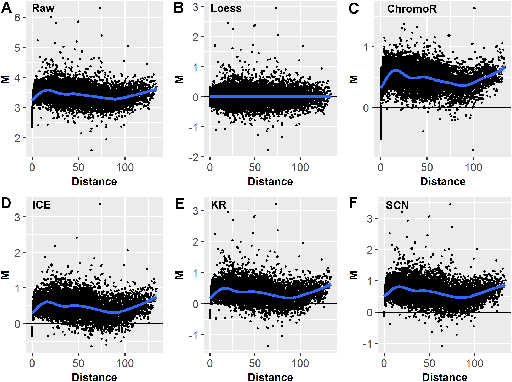

John C. Stansfield^1,3^, Kellen G. Cresswell^1^, Vladimir I. Vladimirov^2^, Mikhail G. Dozmorov^1,3\*^ 

^1^ Dept. of Biostatistics, Virginia Commonwealth University, Richmond, VA, 23298, USA  
^2^ Dept. of Psychiatry, Virginia Institute for Psychiatric and Behavioral Genetics, Richmond, VA, 23219, USA  
^3^ Equal contribution  
^\*^ To whom correspondence should be addressed

# Abstract

**Motivation:** Changes in spatial chromatin interactions are now emerging as a unifying mechanism orchestrating the regulation of gene expression. Hi-C sequencing technology now allows insight into chromatin interactions on a genome-wide scale. However, Hi-C data contains many DNA sequence- and technology-driven biases. These biases prevent effective comparison of chromatin interactions aimed at identifying genomic regions differentially interacting between, disease-normal states or different cell types. Several methods have been developed for normalizing individual Hi-C datasets. However, they fail to account for biases _between two or more Hi-C datasets_, hindering comparative analysis of chromatin interactions.   
**Results:** We developed a simple and effective method, `HiCcompare`, for the joint normalization and differential analysis of multiple Hi-C datasets.  The method avoids constraining Hi-C data within a rigid statistical model, allowing a data-driven normalization of biases using locally weighted linear regression (`loess`). The method identifies region-specific chromatin interaction changes complementary to changes due to large-scale genomic rearrangements, such as copy number variants (CNVs). `HiCcompare` outperforms methods for normalizing individual Hi-C datasets in detecting _a priori_ known chromatin interaction differences in simulated and real-life settings while preserving the detection of genomic structures, such as A/B compartments.   
**Availability:** `HiCcompare` is freely available as a Bioconductor R package [https://bioconductor.org/packages/HiCcompare/](https://bioconductor.org/packages/HiCcompare/).  
**Contact:** mikhail.dozmorov@vcuhealth.org  
**Supplementary information:** Supplementary data are available at _Bioinformatics_ online.

# 1 Introduction

The 3D chromatin structure of the genome is emerging as a unifying regulatory framework orchestrating gene expression by bringing transcription factors, enhancers and co-activators in spatial proximity to the promoters of genes [@Franke:2016aa; @Symmons:2014aa; @Sexton:2015aa; @Li:2012aa; @Papantonis:2013aa; @Laat:2003aa; @Mora:2016aa; @Mifsud:2015aa; @Shavit:2014aa; @Osborne:2004aa]. Together with epigenomic profiles, changes in chromatin interactions shape cell type-specific gene expression [@Fernandez:2012aa; @Liu:2008aa; @Jin:2013aa; @Lieberman-Aiden:2009aa; @Sanyal:2012aa; @Schmitt:2016aa; @Nora:2012aa], as well as misregulation of oncogenes and tumor suppressors in cancer [@Taberlay:2016aa; @Hnisz:2016aa; @Franke:2016aa; @Lupianez:2016aa]. Identifying changes in chromatin interactions is the next logical step in understanding genomic regulation.

Evolution of Chromatin Conformation Capture (3C) technologies into Hi-C sequencing now allows the detection of "all vs. all" long-distance chromatin interactions across the whole genome [@Berkum:2010aa; @Lieberman-Aiden:2009aa; @Sanborn:2015aa]. Soon after public Hi-C datasets became available, it was clear that technology- and DNA sequence-driven biases substantially affect chromatin interactions [@Yaffe:2011aa]. The technology-specific biases include cutting length of a restriction enzyme (HindIII, MboI, or NcoI), cross-linking conditions, circularization length, etc. [@OSullivan:2013aa; @Cournac:2012aa]. The DNA sequence-driven biases include GC content, mappability, nucleotide composition [@Yaffe:2011aa]. Discovery of these biases led to the development of methods for normalizing individual datasets [@Lieberman-Aiden:2009aa; @Imakaev:2012aa; @Yaffe:2011aa; @knight2012fast]. Although normalization of individual datasets improves reproducibility within replicates of Hi-C data [@Imakaev:2012aa; @Yaffe:2011aa; @Hu:2012aa], these methods do not consider biases between multiple Hi-C datasets. 

Accounting for the between-dataset biases is critical for the correct identification of chromatin interaction changes between, e.g., disease-normal states, or cell types. Left unchecked, biases can be mistaken for biologically relevant differential interactions. While DNA sequence-driven biases affect two datasets similarly (e.g., CG content of genomic regions tested for interaction differences is the same), technology-driven biases are poorly characterized and affect chromatin interactions unpredictably. Importantly, another source of chromatin interaction differences are large-scale genomic rearrangements, such as copy number variations [@Harewood:2017aa; @Servant:2015aa], a frequent event in cancer genomes [@Zink:2004aa; @Rickman:2012aa]. Accounting for such biases is needed for the detection of differential chromatin interactions between Hi-C datasets. 

We developed an R package, `HiCcompare`, for the joint normalization and comparative analysis of multiple Hi-C datasets, summarized as chromatin interaction matrices. Our method is based on the observation that chromatin interactions are highly stable [@Dixon:2012aa; @Fudenberg:2016aa; @Rao:2014aa; @Parada:2002aa], suggesting that the majority of them, excluding large genomic rearrangement of regions, can serve as a reference to build a rescaling model. We present the novel concept of the MD plot (difference vs. distance plot), a modification of the MA plot [@dudoit2002statistical], visualizing the distance-centric differences between interacting chromatin regions, where distance is expressed in terms of unit-length size of the regions. The MD plot concept naturally allows for fitting the local regression model, a procedure termed `loess`, and jointly normalizing the two datasets by balancing biases between them. The distance-centric view of chromatin interaction differences allows for detecting statistically significant differential chromatin interactions between two Hi-C datasets using a simple but robust permutation method. We show improved performance of differential chromatin interaction detection when using the jointly vs. individually normalized simulated and real Hi-C datasets. Our method is broadly applicable to a range of biological problems, such as identifying differential chromatin interactions between tumor and normal cells, immune cell types, and normal tissues.

# 2 Methods

## 2.1 Visualization of the differences between two Hi-C datasets using an MD plot

A chromosome-specific Hi-C matrix is a square matrix of size $NxN$, where $N$ is the number of genomic regions of size $X$ on a chromosome. The size $X$ of the genomic regions defines the resolution of the Hi-C data. Each cell in the matrix contains an interaction frequency $IF_{i,j}$, where $i$ and $j$ are the indices of the interacting regions. For this study, data in the sparse upper triangular format from the GM12878 and RWPE1 cell lines were used (Supplementary Section 1).

The first step of the `HiCcompare` procedure is to convert the data into what we refer to as an MD plot. The MD plot is similar to the MA plot (Bland-Altman plot) commonly used to visualize gene expression differences [@dudoit2002statistical]. $M$ is defined as the log difference between the two data sets $M = log_2(IF_2/IF_1)$, where $IF_1$ and $IF_2$ are interaction frequencies of the first and the second Hi-C datasets, respectively. $D$ is defined as the distance between two interacting regions, expressed in unit-length of the $X$ resolution of the Hi-C data. In terms of chromatin interaction matrices, $D$ corresponds to the off-diagonal traces of interaction frequencies (Supplementary Section 2). Because chromatin interaction matrices are sparse, i.e. contain an excess of zero interaction frequencies, by default only the non-zero pairwise interaction are used for the construction of the MD plot with an option to use partial interactions, i.e. with a zero value in one of the matrices and a non-zero IF in the other.

## 2.2 Joint normalization of multiple Hi-C data using `loess` regression

After the transformation of the data into an MD plot, `loess` regression [@cleveland1979robust] is performed with $D$ as the predictor for $M$. The fitted values are then used to normalize the original IFs. 

$$\begin{cases} log_2(\hat{IF}_{1D}) = log_2(IF_{1D}) + f(D)/2 \\
log_2(\hat{IF}_{2D}) = log_2(IF_{2D}) - f(D)/2
\end{cases}  $$

where $f(D)$ is the predicted value from the `loess` regression at a distance $D$. The $log_2(\hat{IF})$ values are then anti-logged to obtain the normalized IFs. Note that for both Hi-C datasets the average interaction frequency remains unchanged, as the one set is increased by the factor of $f(D)/2$ while the other is decreased by the same amount. Any normalized IFs with values less than 1 are not considered in further analyses. The joint normalization was tested against five methods for normalizing individual Hi-C matrices, `ChromoR` [@Shavit:2014aa], `ICE` [@Imakaev:2012aa], `KR` [@knight2012fast], `SCN` [@Cournac:2012aa], `MA` [@Lun:2015aa] normalizations (Supplementary Section 1).

## 2.3 Excluding potentially problematic regions from the joint normalization

The between-dataset biases may occur due to large-scale genomic rearrangements and copy number variants (CNVs), a frequent case in tumor-normal comparisons [@Rickman:2012aa]. Similar to removing other biases, the joint `loess` normalization removes CNV-driven biases by design, allowing for the detection of chromatin interaction differences within CNV regions. However, CNVs introduce large changes in chromatin interactions [@Servant:2015aa], which may be of interest to consider separately. Therefore, unless cells/tissues with normal karyotypes are compared, we provide functionality for the detection and removal of genomic regions containing CNVs from the joint normalization. The `QDNAseq` [@Scheinin:2014aa] R package is used to detect and exclude CNVs from any further analysis. Alternatively, CNV regions can be detected separately and provided to `HiCcompare` as a BED file. Additionally, the `HiCcompare` package includes the ENCODE blacklisted regions for hg19 and hg38 genome assemblies, which can be excluded from further analysis. 

## 2.4 Detection of differential chromatin interactions

<!-- After joint normalization, the normalized chromatin interaction matrices are ready to be compared for differences. Again, the MD plot is used to represent the differences $M$ between two normalized datasets at a distance $D$. At a given distance $d$, each difference $M_{id}$ is tested for significance using a permutation test: -->

<!-- $$ p_i = \frac{\sum_{k=1}^n{I(|S_k| > |M_{id}|)} + 1}{n + 1} $$ -->
<!-- \ \  -->

<!-- where $S$ is a sample of size $n$, taken with replacement, of differences sampled from a vector of $M_d$, and $M_{id}$ is the $i^{th}$ difference tested for significance. $I$ is the identity function. Since the number of differences diminishes with the increasing genomic distance (less off-diagonal IFs in the upper right corner of interaction matrices), differences for the top 15% of farther distances are combined to have a pool of variables for permutation purposes. Note that the permutation framework also accounts for multiple testing correction. A user-specified significance threshold $\alpha$ (typically, 0.05) is used to define significant differential chromatin interaction frequencies. To reduce the number of false positives, we provide the option to filter the final p-values $p_{M_{id}}$ by a user-specified or automatically calculated $M' = 2 * \sqrt{Var(M)}$. This option allows for the user to pre-specify the meaningful difference between the two Hi-C datasets that must be reached in order to call a difference truly significant. -->

After joint normalization, the chromatin interaction matrices are ready to be compared for differences. Again, the MD plot is used to represent the differences $M$ between two normalized datasets at a distance $D$. Normalized $M$ values are centered around 0 and are approximately normally distributed across all distances (Supplementary Section 1). $M$ values can be converted to Z-scores using the standard approach:

$$
Z_i = \frac{M_i - \bar{M}}{\sigma_M}
$$
where $\bar{M}$ is the mean value of all $M$'s on the chromosome and $\sigma_M$ is the standard deviation of all $M$ values on the chromosome and $i$ is the $i$th interacting pair on the chromosome. 

## 2.5 Filtering low-abundance interaction pairs

During Z-score conversion the average expression of each interacting pair is considered. Due to the nature of $M$, a difference represented by an interacting pair with IFs 1 and 10 is equivalent to an interacting pair of IFs 10 and 100 with both differences producing an $M$ value of 3.32. However the average expression of these two differences is 5.5 and 55, respectively. Differences with higher average expression are more trustworthy than those with low average expression due to the fact that a relatively small difference on the raw scale can lead to a large log2 fold change. Additionally since the IFs represent Hi-C sequencing reads, lower average numbers of reads are also less trustworthy. Thus we filter out differences with low average expression by setting the Z-scores to 0 when average expression ($A$) is less than a user set quantile (typically 5-20%) or a user set specific value of $A$ (Supplementary Section 1). Filtering takes place such that the $\bar{M}$ and $\sigma_M$ are calculated using only the $M$ values remaining after filtering. The Z-scores can then be converted to p-values using the standard normal distribution.

## 2.6 Multiple testing correction

Analyzing Hi-C data for differences necessarily requires multiple testing. Multiple testing correction is applied on a per-distance basis by default (with an option to apply it on a chromosomal basis). The per-distance multiple testing correction works by grouping the p-values by their distances. Then the desired multiple testing correction (FDR by default) can be applied to each distance group of p-values. 

## 2.7 Benchmarking the differential chromatin interaction detection

The effect of individual vs. joint normalization methods on the power of detection of differential chromatin interactions must be estimated on _a priori_ known differences [@Dozmorov:2010aa]. As there is no "gold standard" for differential chromatin interactions, we created such _a priori_ known differences by introducing controlled changes to replicate Hi-C datasets. The benefit of using joint normalization vs. individually normalized datasets was quantified by the improvement in power of pre-defined chromatin interaction differences. Standard classifier performance measures (Supplementary Section 4), summarized in Matthews Correlation Coefficient (MCC), were assessed. The results of `HiCcompare` analysis were compared with those obtained with `diffHiC` method [@Lun:2015aa].

## 2.8 Concordance between principal components (PCs) defining A/B compartments

To assess the effect of normalization of the detection of A/B compartments, they were defined using the Principal Components Analysis (PCA) method introduced in [@Lieberman-Aiden:2009aa] using the raw, jointly and individually normalized Hi-C data. The consistency of compartments was evaluated using three metrics: 1) the Pearson correlation coefficient between vectors of principal components (PCs), 2) the overlap of signs of PCs defining A (positive) and B (negative) compartments, and 3) the Jaccard overlap statistics.

## Parallelization

## Availability and Future Directions

`HiCcompare` is available on Bioconductor at [https://bioconductor.org/packages/HiCcompare/](https://bioconductor.org/packages/HiCcompare/) or on GitHub at [https://github.com/dozmorovlab/HiCcompare](https://github.com/dozmorovlab/HiCcompare). The package includes a vignette with instructions and documentation for all functions included in `HiCcompare` along with a sample analysis. Test data is included in the package for use with the vignette. Additionally, the `supplemental` branch of the GitHub repository contains code to generate all supplemental files referenced in this manuscript. `HiCcompare` is released under the MIT open source software license.

# 3 Results

## 3.1 The off-diagonal concept of distance between regions in chromatin interaction matrices 

Our study focuses on the joint analysis of multiple Hi-C datasets represented by chromatin interaction matrices, where rows and columns represent genomic regions (bins), and cells contain interaction counts (frequencies). The values on the diagonal trace represent interaction frequencies of self-interacting regions. Each off-diagonal trace of values represents interaction frequencies for a pair of regions at a given unit-length distance. The unit-length distance is expressed in terms of resolution of the data (the size of genomic regions). The concept of considering interaction frequencies at each off-diagonal trace is central for the joint normalization and differential chromatin interaction detection (Supplementary Figure S1A).

The interaction frequency drops as the distance between interacting regions increases. Numerous attempts have been made to parametrically model the inverse relationship between chromatin interaction frequency and the distance between interacting regions. These include power-law [@Lieberman-Aiden:2009aa; @Sanborn:2015aa], double exponential [@Tanizawa:2010aa], binomial [@Mifsud:2017aa], Poisson and negative binomial [@Jin:2013aa; @Cairns:2016aa; @Hu:2012aa; @Shavit:2014aa], and zero-inflated negative binomial [@Di-Stefano:2016aa] distributions. However, Hi-C data are affected by technology- and DNA sequence-driven biases [@Yaffe:2011aa; @Cournac:2012aa; @Imakaev:2012aa; @Phillips-Cremins:2017aa], unpredictably altering chromatin interaction frequencies. Consequently, parametric approaches fail to model interaction frequencies across the full range of distances [@Sanborn:2015aa], confirmed by our observations (Supplementary Figure S1B). 

## 3.2 Elimination of biases in jointly, but not individually, normalized Hi-C data

Discovery of biases in Hi-C data led to the development of numerous methods for normalizing _individual_ datasets [@Lieberman-Aiden:2009aa; @Imakaev:2012aa; @knight2012fast; @Cournac:2012aa; @Hu:2012aa]. Although normalization of individual datasets improves reproducibility of replicated Hi-C data [@Imakaev:2012aa; @Yaffe:2011aa; @Hu:2012aa], these methods do not explicitly account for biases between _multiple_ Hi-C data. The between-datasets biases are particularly problematic when comparing Hi-C datasets between biological conditions [@Phillips-Cremins:2017aa] (Supplementary Section 3). When the detection of chromatin interaction differences due to biology, not biases, is important, normalization that removes the between-datasets biases is critical.  

To assess the between-dataset biases, we visualize two Hi-C datasets on a single MD plot (see Methods). Briefly, differences in chromatin interaction frequencies (**M**inus) are visualized on a per-unit-length distance basis. Chromatin interactions are highly conserved [@Dixon:2012aa; @Fudenberg:2016aa; @Rao:2014aa], thus the majority of the **M** differences should be centered around zero. The MD plot visualization allows us to identify systematic biases appearing as the offset of the cloud of **M** differences from zero. Visualizing replicates of Hi-C data (Gm12878 cell line) showed the presence of biases in the individually normalized datasets (Figure 1, Supplementary Section 3), suggesting that the performance of individual normalization methods may be sub-optimal when comparing multiple Hi-C datasets.

To account for the between-datasets biases, we developed a non-parametric joint normalization method that makes no assumptions about the theoretical distribution of the chromatin interaction frequencies. It utilizes the well-known `loess` (locally weighted polynomial regression) smoothing algorithm - a regression-based method for fitting simple models to segments of data [@cleveland1979robust]. The main advantage of `loess` is that it accounts for any local irregularities _between_ the datasets that cannot be modeled by parametric methods. Thus, `loess` is particularly appealing when normalizing two Hi-C datasets, as the internal biases in Hi-C data are poorly understood (Figure 1).

+-------+
|       |
| **Figure 1.** MD plot data visualization and the effects of different normalization techniques. MD plots of the differences M between two replicated Hi-C datasets (GM12878 cell line, chromosome 11, 1MB resolution, DpnII and MboI restriction enzymes) plotted vs. distance D between interacting regions. (A) Before normalization, (B) after loess joint normalization, (C) ChromoR, (D) Iterative Correction and Eigenvector decomposition (ICE), (E) Knight-Ruiz (KR), (F) Sequential Component Normalization (SCN). |
+-------+

Existing Hi-C data at high resolutions still suffer from a limited dynamic range of chromatin interaction frequencies, with the majority of them being small or zero, especially at large distances between interacting regions. This sparsity places limits on `loess` joint normalization, as it builds a rescaling model from many non-zero pairwise comparisons. A way to alleviate this limitation is to consider interactions only within a range of short interaction distances, where genomic regions interact more frequently and the proportion of zero interaction frequencies is the lowest. Our evaluation of the `loess` joint normalization showed it performs best to removes biases at resolutions between 1MB and 100KB (Supplementary Section 3).

## 3.3 Detecting differential chromatin interactions

To detect significant chromatin interaction differences, we introduced _a priori_ known chromatin interaction differences in replicate data from the GM12878 cell line. The benefits of the joint normalization vs. individually normalized datasets was evaluated in detecting the known differences. `HiCcompare` is able to detect most of the added differences with a relatively low number of false positives across the range of fold changes (Table 1, Supplementary Section 4).

**Table 1. Evaluation of the effect of normalization on differential chromatin interaction detection.** Matthews Correlation Coefficient of detecting 200 controlled differences in jointly (`HiCcompare`) vs individually normalized Gm12878 datasets, chromosome 1, 1Mb resolution.

<!--Generated from /Users/mdozmorov/Documents/Work/VCU_work/3D_DNA/HiCcompare/supplementary/04_Differential_MCC_summary.csv-->
| Fold change | HiCcompare |   MA  |  ICE  |  SCN  |   KR  |
|:-----------:|:----------:|:-----:|:-----:|:-----:|:-----:|
|      2      |    0.847   | 0.823 | 0.835 | 0.768 | 0.748 |
|      3      |    0.973   | 0.934 | 0.802 | 0.721 | 0.764 |
|      4      |    0.995   |  0.98 | 0.953 | 0.881 | 0.868 |
|      5      |    0.972   | 0.967 | 0.748 | 0.722 | 0.755 |

## 3.4 Comparison with `diffHiC`

The `diffHiC` pipeline was designed to process raw Hi-C sequencing data and detect chromatin interaction differences using the generalized linear framework developed in the `edgeR` package [@Lun:2015aa]. We compared the results of Hi-C data analyzed in the `diffHiC` paper (human prostate epithelial cells RWPE1 overexpressing the EGR protein or GFP [@Robinson:2010aa]) with the results obtained with `HiCcompare`. 

`diffHic` detected a total of 5,737 significant differences (FDR < 0.05), while `HiCcompare` tended to be more conservative in difference detection. `HiCcompare` detected 314 differences when FDR multiple testing correction was used (FDR < 0.05) and 7,620 differences when multiple testing corrections were not considered (P < 0.05). Of the 314 differences, 121 overlapped with the regions detected by `diffHic` and of the 7,620 differences, 1,654 overlapped with the regions detected by `diffHic`. Surprisingly, although `diffHiC` used CNV correction in their analysis, 2,567 (44.7%) of the detected differentially interacting regions overlapped with CNV regions detected in our analysis, and/or blacklisted regions. `diffHic` tended to detect differentially interacting regions with smaller fold changes as compared to `HiCcompare`, and at shorter distances between interacting regions, while `HiCcompare` can detect differences across the full range of distances (Supplementary Section 5). These results suggest that detecting chromatin interaction differences represented in MD coordinates, as implemented in `HiCcompare`, may be useful in detecting large chromatin interaction differences across the full range of distances, potentially having more significant biological effect.

## 3.5 Preservation of A/B compartments

A/B compartments are the best known genomic structures that can be detected from Hi-C data [@Lieberman-Aiden:2009aa]. To understand the consequences of the joint vs. individual normalization methods on the detection of A/B compartments we compared principal components defining compartments in raw vs. normalized data. A/B compartments detected following the joint normalization were the most similar to those detected in the raw data (Table 2). These results suggest that the joint `HiCcompare` normalization preserves properties of Hi-C data needed for the accurate detection of genomic structures.

**Table 2. Similarity between A/B compartments detected following various normalization methods.** Raw Hi-C data was used as a reference to compare A/B compartments detected from it vs. those detected in normalized data. "Correlation" - Pearson correlation coefficient between principal components defining A/B compartments; "Prop. Match Sign" - proportion of regions with matching sign defining A/B compartments; "Jaccard A/B" - Jaccard overlap statistics between A/B compartments, respectively. All values represent averages over all chromosomes.

|   Comparison       | Correlation | Prop. Match Sign | Jaccard A | Jaccard B |
|:------------------:|:-----------:|:----------------:|:---------:|:---------:|
| HiCcompare vs. Raw |    0.9954   |      0.8537      |   0.8719  |   0.8284  |
|  SCN vs. Raw       |    0.9309   |      0.8083      |   0.6641  |   0.5737  |
|  ICE vs. Raw       |    0.9795   |       0.785      |   0.6969  |   0.6141  |

<!--Taken together, our results demonstrate the importance of the joint normalization when comparing Hi-C datasets. We introduce the concept of distance-centric view of Hi-C data, implemented as an intuitive distance-centric visualization of two Hi-C datasets on the $MD\ plot$. The $MD\ plot$ representation allows for the joint loess normalization that improves power in detecting true chromatin interaction differences and preserves data properties needed for the accurate detection of A/B compartments. The `HiCcompare` R package implements the visualization, joint normalization, and differential chromatin interaction detection algorithms, allowing for the comparison of Hi-C data.-->

# Discussion

This work introduces three novel concepts for the joint normalization and differential analysis of Hi-C data, implemented in the `HiCcompare` R package. First, we introduce the representation of the differences between two Hi-C datasets on an $MD\ plot$, a modification of the MA plot [@dudoit2002statistical]. Importantly, we consider the data on a per-unit-length-distance basis, allowing normalization of global biases without distorting the relative distribution of interaction frequencies of the interacting regions. Second, we implement a non-parametric `loess` normalization method that jointly accounts for biases in the normalzied datasets. There is compelling evidence that non-parametric normalization methods, such as quantile- and `loess` normalization, are particularly suitable for removing the between-dataset biases [@Shao:2012aa; @Bolstad:2003aa], confirmed by our application of `loess` to the joint normalization of Hi-C data. Third, we develop and benchmark a simple but rigorous statistical method for the differential analysis of Hi-C datasets.

Increasing the resolution of Hi-C data requires a significant increase in sequencing coverage. To achieve the genome-scale coverage at kilobase-pair resolution conventional Hi-C experiments require billions of DNA sequencing reads [@Jin:2013aa; @Rao:2014aa]. Existing Hi-C data at high resolutions still suffer from a limited dynamic range of chromatin interaction frequencies, with the majority of them being small or zero, especially at large distances between interacting regions (S7 File). The problem is exacerbated in single-cell Hi-C technology, which generates very sparse Hi-C data even at 1Mb resolution [@Nagano:2013aa]. This sparsity places limits on `loess` joint normalization, as it builds a rescaling model from many non-zero pairwise comparisons. This sparsity explains our observed sub-optimal performance of `loess` in higher resolution data (S7 File). A way to alleviate this limitation is to consider interactions only within a range of short interaction distances, where genomic regions interact more frequently and the proportion of zero interaction frequencies is the lowest. Decreasing costs of sequencing technologies will eventually overcome the problem of insufficient coverage of high-resolution chromatin interaction matrices, making them amenable for `loess` joint normalization and the detection of differential chromatin interactions.

The discrepancy of differential chromatin interaction detection between diffHiC and HiCcompare could arise from multiple factors. diffHiC operates on logCPM counts while HiCcompare uses interaction frequency counts. diffHiC uses different bin sizes when partitioning the genome while HiCcompare uses fixed bin sizes. diffHiC filters low-abundance bin pairs (IFs less than median inter-chromosomal IF) while HiCcompare filters based on average IFs of the chromosome being considered. Finally, the RWPE1 data is relatively sparse even at coarse 1Mb resolution, hindering statistical analyses.

# Acknowledgements

Research reported in this publication was supported in part by the Institutional Research Grant IRG-14-192-40 from the American Cancer Society to MD, and by the National Institute Of Environmental Health Sciences of the National Institutes of Health under Award Number T32ES007334 supporting JS. The content is solely the responsibility of the authors and does not necessarily represent the official views of the National Institutes of Health and the American Cancer Society.

# References

